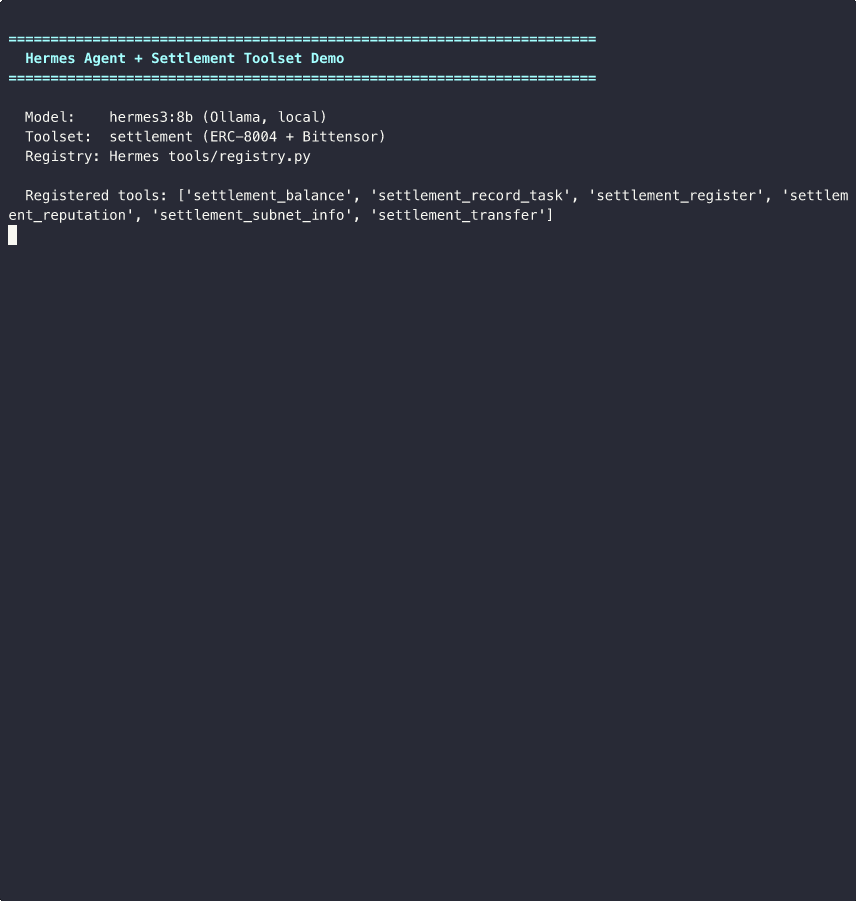

# hermes-settlement

An autonomous agent that reasons with [Hermes](https://nousresearch.com/hermes/), proves identity through [ERC-8004](https://github.com/ethereum/ERCs) on-chain registration, and settles work on [Bittensor](https://bittensor.com/).

Most "AI agent" demos stop at the API call. This one goes further: the agent registers a verifiable on-chain identity, records every completed task to an immutable ledger, builds reputation that other agents and contracts can query, and participates in Bittensor's incentive network for economic settlement. Everything runs against real infrastructure — Anvil for EVM, Bittensor testnet, Nous Portal for inference.

<table>
<tr>
<td align="center"><strong>Agent — all backends live</strong></td>
<td align="center"><strong>Hermes 4 405B + settlement tools</strong></td>
</tr>
<tr>
<td></td>
<td></td>
</tr>
<tr>
<td>ERC-8004, Bittensor testnet, Hermes inference</td>
<td>Nous model calling tools via Hermes registry</td>
</tr>
</table>

## Why this exists

Agents need more than inference. They need:

- **Identity** — a way to prove who they are, on-chain, verifiable by anyone
- **Reputation** — a track record that accumulates with every task, not just a system prompt claiming competence
- **Settlement** — real economic participation, not simulated token balances

This repo wires all three together with Nous Research's open-weight models as the reasoning layer. The agent doesn't just call tools — it owns a wallet, stakes ETH to register, and builds reputation that lives on a blockchain.

## Stack

| Layer | Implementation | Role |
|-------|---------------|------|
| **Reasoning** | Hermes 4 405B (Nous Portal) | Tool-calling LLM — decides what to do |
| **Identity** | AgentRegistry.sol (ERC-8004) | On-chain registration with stake bond |
| **Reputation** | ERC-8004 + Bittensor metagraph | Composite score from task history + subnet metrics |
| **Settlement** | Bittensor testnet | TAO balances, subnet participation, native transfers |
| **Transport** | A2A over HTTP | Agent-to-agent communication (JSON-RPC) |

## Architecture

```
agent/
  core/           Agent orchestrator, wallet, keystore
  daemon/         Hermes LLM interface (Hermes > Ollama > OpenAI > mock)
  settlement/     SettlementClient ABC + ERC-8004 + Bittensor implementations
  transport/      A2A-over-HTTP (direct agent communication)
  skills/         Pluggable skill SDK (settlement, agent, meta skills)

contracts/
  src/            AgentRegistry.sol — ERC-8004 identity + reputation contract

hermes_toolset/
  settlement_tool.py  — Drop-in toolset for Hermes Agent (6 tools)
```

The settlement layer is abstract — `SettlementClient` defines the interface, `ERC8004Client` and `BittensorClient` are concrete implementations. The agent connects to whatever backends are available and falls back gracefully.

## Quick start

```bash
pip install web3 httpx bittensor

# Deploy the identity contract (requires Foundry)
anvil &
cd contracts && forge create src/AgentRegistry.sol:AgentRegistry \
  --private-key 0xac0974bec39a17e36ba4a6b4d238ff944bacb478cbed5efcae784d7bf4f2ff80 \
  --broadcast

# Run the full demo — all three backends live
ERC8004_PRIVATE_KEY="0xac0974bec39a17e36ba4a6b4d238ff944bacb478cbed5efcae784d7bf4f2ff80" \
  python scripts/demo_e2e.py
```

The demo runs 10 steps: wallet init, settlement connection, on-chain registration, LLM detection, task evaluation, task recording, reputation query, and balance check. Everything hits real infrastructure.

## Hermes Agent integration

The `hermes_toolset/` directory is a drop-in for [Hermes Agent](https://github.com/NousResearch/hermes-agent). Copy one file into `hermes-agent/tools/` and the settlement tools auto-register through the Hermes tool registry:

```bash
cp hermes_toolset/settlement_tool.py ~/hermes-agent/tools/
```

This gives Hermes 6 new tools:

| Tool | What it does |
|------|-------------|
| `settlement_register` | Register identity on-chain with ETH stake |
| `settlement_reputation` | Query reputation from ERC-8004 + Bittensor |
| `settlement_record_task` | Record task completion on-chain |
| `settlement_balance` | Check ETH + TAO balances |
| `settlement_subnet_info` | Query Bittensor subnet metagraph |
| `settlement_transfer` | Transfer TAO natively |

The model decides when to call them. Ask "register me on-chain" and Hermes calls `settlement_register`. Ask "what's my reputation?" and it calls `settlement_reputation`. No hardcoded routing — the LLM reads the tool descriptions and picks.

See [`hermes_toolset/README.md`](hermes_toolset/README.md) for full setup.

## The contract

`AgentRegistry.sol` is a minimal ERC-8004 implementation:

- **Register** with a public key hash, capability hash, and ETH stake
- **Record tasks** — success or failure, immutable on-chain
- **Query reputation** — score derived from task success rate
- **Stake bond** — skin in the game, slashable in future versions

It's a reference shape, not a production contract. ERC-8004 is early — this captures the interface.

## What's real

Every data point in the demos comes from a live system:

- Chain ID 31337 (Anvil), contract deployed at `0x5FbDB2315678afecb367f032d93F642f64180aa3`
- Bittensor testnet block 7M+, 467 subnets, 256 neurons on subnet 1
- Hermes 4 405B via `inference-api.nousresearch.com` with native tool calling
- Transaction hashes from actual on-chain state changes
- ETH balance reflects real gas spent on registration and task recording

No mocks. No simulated responses. No hardcoded outputs.

## License

MIT
